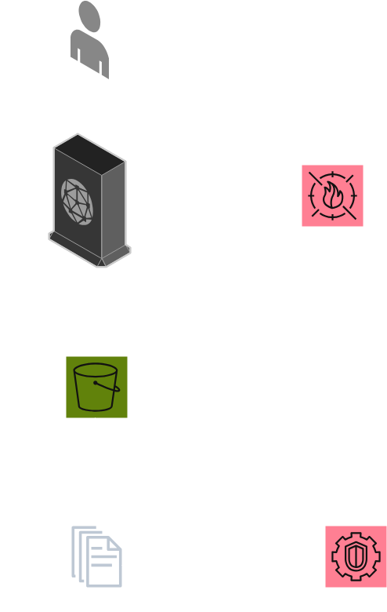

# Secure AWS S3 Static Website with WAF & GuardDuty

This project demonstrates how to securely host a **static website** on AWS using:
- **Amazon S3** (private bucket for content)
- **Amazon CloudFront** (CDN + HTTPS, Origin Access Control to read S3 privately)
- **AWS WAF** (blocking common attacks like SQLi & XSS)
- **Amazon GuardDuty** (threat detection & continuous monitoring)

Everything is provisioned with **Terraform** to ensure repeatability and Infrastructure as Code best practices.

---

## 🏗 Architecture



- **S3** → Hosts the static website content (private only)  
- **CloudFront** → Serves the content globally over HTTPS  
- **WAF** → Protects CloudFront with managed rules + rate limiting  
- **GuardDuty** → Monitors for malicious or unauthorized activity  
- **CloudTrail** → Provides auditing/logging (implicitly enabled)  

---

## 🚀 Deployment

```bash
cd infrastructure

terraform init
terraform plan -out tf.plan
terraform apply tf.plan
